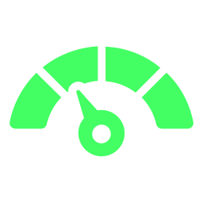
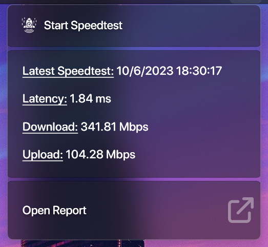

<h1 align="center">
   
  
   
  Speedtest - Bunz
   
</h1>

<h4 align="center">Tests the speed and performance of your internet connection.</h4>

  
  
  
  

  <a href="#key-features">Key Features</a> •
  <a href="#how-to-use">How To Use</a> •
  <a href="#download">Download</a> •
  <a href="#license">License</a>

## Key Features
Uses the https://speedtest.net CLI app (It's downloaded the first time you use the app, and it's stored inside the app folders, so it can be deleted with the Community App)

## How to use
Just click on the "Start Speedtest" button and wait for it to finish the test!

## Download
Download from [releases](https://github.com/66Bunz/DroptopFour-Speedtest/releases) or from the [website](https://droptopfour.com/community-apps?id=26)

## License
[GNU General Public License v3.0](LICENSE)

Feel free to modify or redistribute these Rainmeter skins as much as you want. Just:
- Link back to me somehow
- Use ths same license
